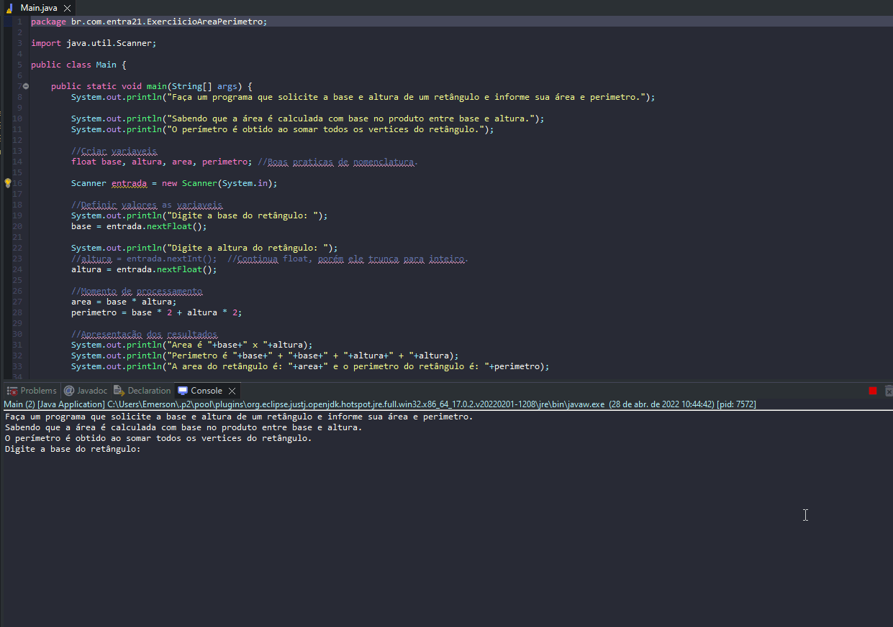

# Exercicio - Área e Perímetro

- Faça um programa que solicite a base e altura de um retângulo e informe sua área e perimetro
- Sabendo que a área é calculada com base no produto entre base e altura.
- O perímetro é obtido ao somar todos os vertices do retângulo.

## Aplicação em uso.

