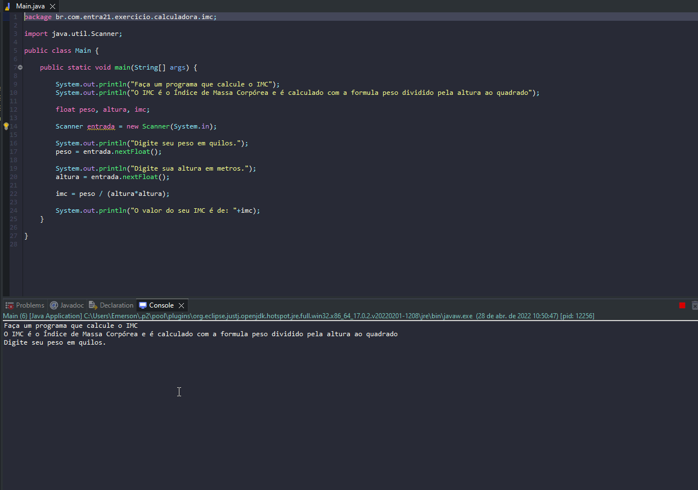

# Exercise - BMI Calculator

- Make a program that calculates BMI.
- BMI is the Body Mass Index and is calculated with the formula weight divided by height squared.
- BMI = WEIGHT / (HEIGHT^2)

## Application in use.

### To access the PT-BR version of this guide, click [here](./README_PT-BR.md).