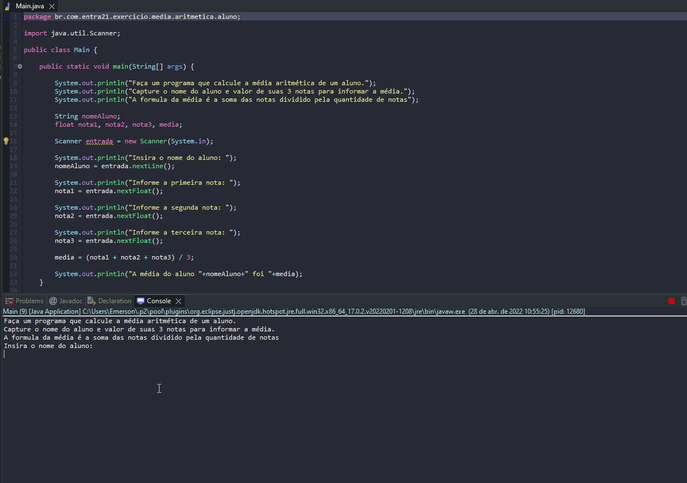

# Exercicio - Calculo Média Aritmetica

- Faça um programa que calcule a média aritmética de um aluno.
- Capture o nome do aluno e valor de suas 3 notas para informar a média.
- A formula da média é a soma das notas dividido pela quantidade de notas.

## Aplicação em uso.

