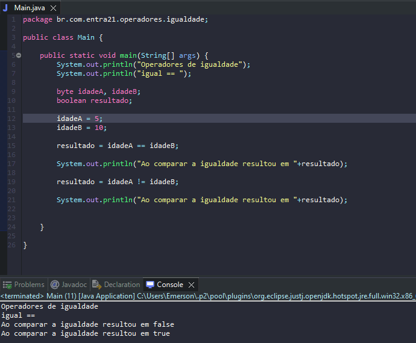

# Aprendendo sobre operadores de igualdade.

- É uma forma de comparar valores entre as variáveis e constantes.
- Se trata de um método útil durante as execuções com if/else

## Formas

- Igual a (==)
- Diferente de (!=)

## Exemplos

