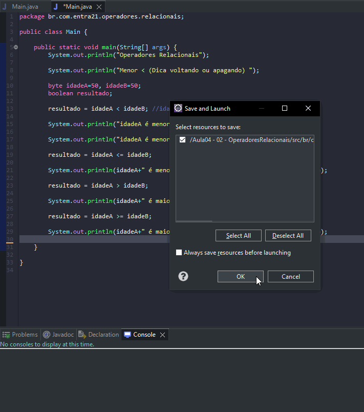

# Aprendendo sobre operadores relacionais

- É uma forma de comparar valores entre as variáveis e constantes.
- Se trata de um método útil durante as execuções com if/else

## Formas

- Maior (>)
- Menor (<)
- Maior ou igual (>=)
- Menor ou igual (<=)

## Exemplos

