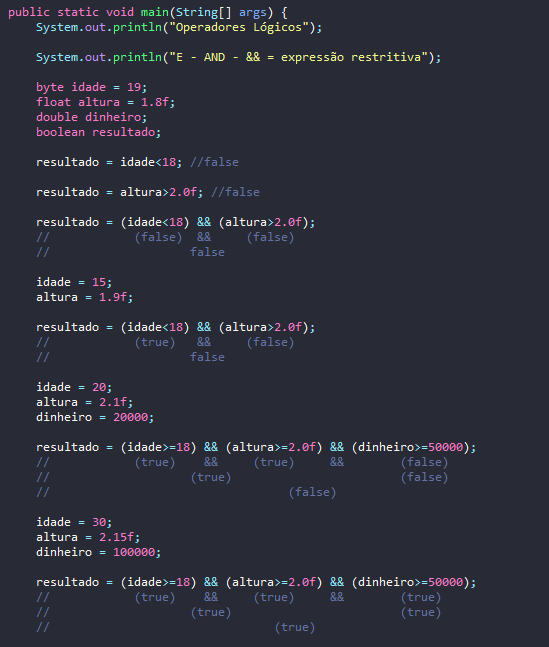
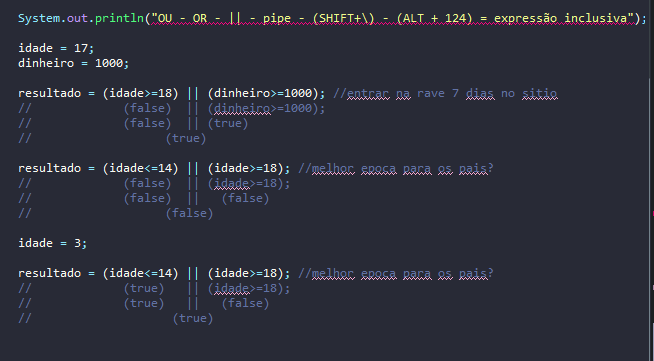

# Aprendendo sobre operadores logicos

- É uma forma de comparar valores entre as variáveis e constantes.
- Se trata de um método útil durante as execuções com if/else

## Formas / Tabela Verdade

- E / AND ( && )

| A | B | RESULTADO |
|---|---|-----------|
| T | T |     T     |
| T | F |     F     |
| F | T |     F     |
| F | F |     F     |

- OU / OR ( || )

| A | B | RESULTADO |
|---|---|-----------|
| T | T |     T     |
| T | F |     T     |
| F | T |     T     |
| F | F |     F     |

## Exemplos &&

## Exemplos ||

