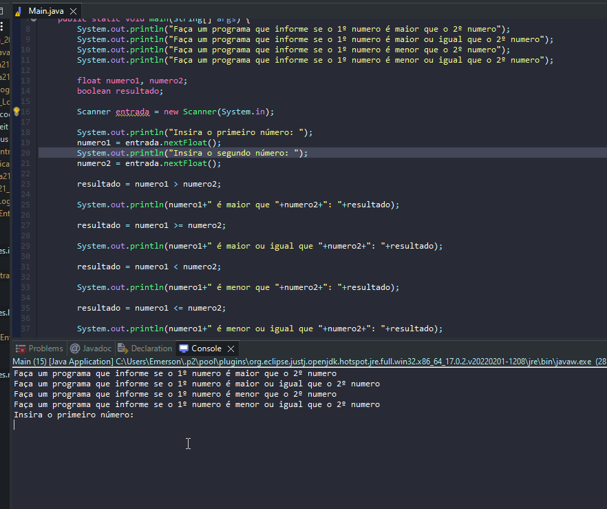

# Exercicio - operador relacional

- Faça um programa que informe se o 1º numero é maior que o 2º numero.
- Faça um programa que informe se o 1º numero é maior ou igual que o 2º numero.
- Faça um programa que informe se o 1º numero é menor que o 2º numero.
- Faça um programa que informe se o 1º numero é menor ou igual que o 2º numero.

## Aplicação em uso.

