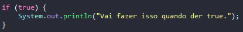

# Aprendendo sobre condicional if

- É uma forma de tomar decisões no código com base em condições

## Formas de uso

````
if(condicao){
    conjunto de codigos quando a condição resultar em true.
}
````

## Exemplos If


