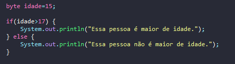

# Aprendendo sobre condicional if e else

- É uma forma de tomar decisões no código com base em condições.
- Caso a primeira condição não seja satisfeita, no caso resulte em false, o código do else será executado.

## Formas de uso

````
if(true) {
    Vai passar aqui quando a condição resultar em true;
} else {
    Vai passar aqui quando a condição resultar em false;
}
````

## Exemplos If


