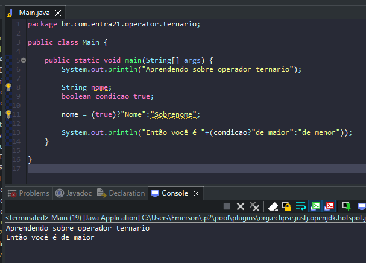

# Aprendendo sobre operador ternario

- É uma forma de tomar decisões usando o if/else de forma simplificada.
- Usado apenas em situaçoes simples.

## Formas de uso

````
String nome;
boolean condicao=true;

nome = (true)?"Nome":"Sobrenome";

System.out.println("Então você é "+(condicao?"de maior":"de menor"));
````

## Exemplos 


