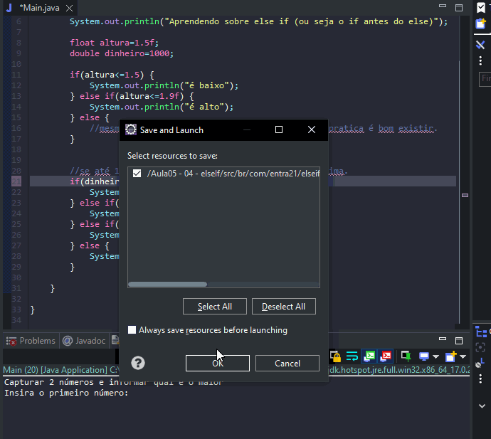

# Aprendendo sobre uso de else if

- É uma forma de tomar decisões usando mais de uma condições.

## Formas de uso

````
double dinheiro=1000;
	
if(dinheiro<=1200) {
    System.out.println("Salario minimo");
} else if(dinheiro<=1800) {
    System.out.println("ta ficando rico");
} else if(dinheiro<=2000) {
    System.out.println("me empresta :)");
} else {
    System.out.println("Me contrata vai.");
}
````

## Exemplos 


