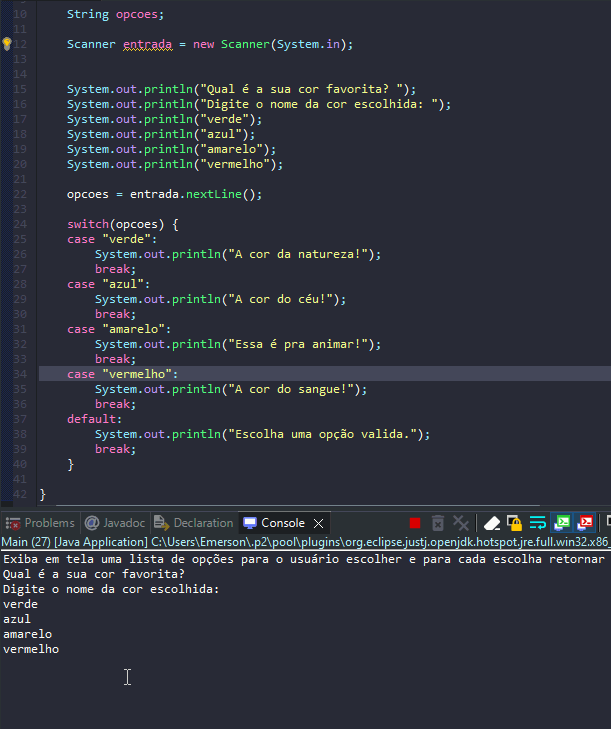

# Aprendendo sobre uso de Condicionais Switch

- É uma forma de tomar decisões usando mais de uma condição.
- Usado para decisões diretas.
- É uma forma de economizar recursos.

## Formas de uso

````
opcoes = entrada.nextLine();
		
		switch(opcoes) {
		case "verde":
			System.out.println("A cor da natureza!");
			break;
		case "azul":
			System.out.println("A cor do céu!");
			break;
		case "amarelo":
			System.out.println("Essa é pra animar!");
			break;
		case "vermelho":
			System.out.println("A cor do sangue!");
			break;
		default:
			System.out.println("Escolha uma opção valida.");
			break;
		}
````

## Exemplos 


