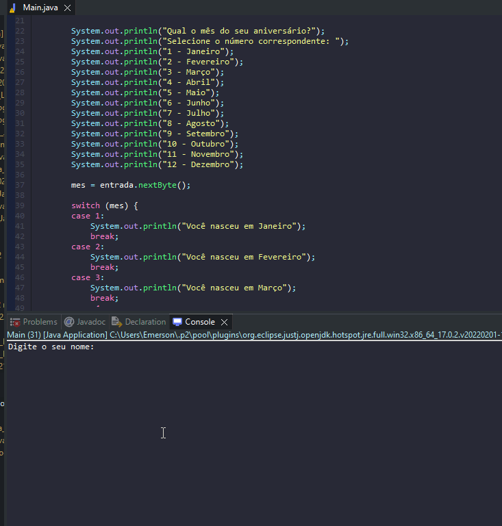

# Exercicio - Revisão Estruturas de Controle

- Escreva um programa que:
````
- Solicite ao usuário o seu nome e o mês de seu aniversário
- A captura do mês deve ser por numero
- Exibir uma mensagem com o nome e o mês no formato normal (Ex: 4  Abril, 12 Dezembro)
- Caso não seja escolhido um mês válido deve exibir uma mensagem
````

## Aplicação em uso.

