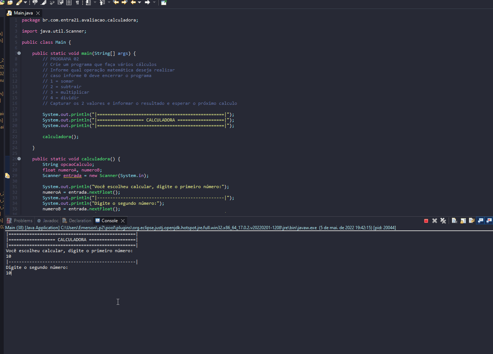

# Java Test - Calculator

- Create a program that does multiple calculations.
````
- Tell which math operation you want to perform.
- Capture the 2 values and inform the result and wait for the next calculation.
- if it informs 0, it must terminate the program
- 1 - Add;
- 2 - Subtract;
- 3 - Multiply;
- 4 - Divide;
````
---

## Application in use.

#



