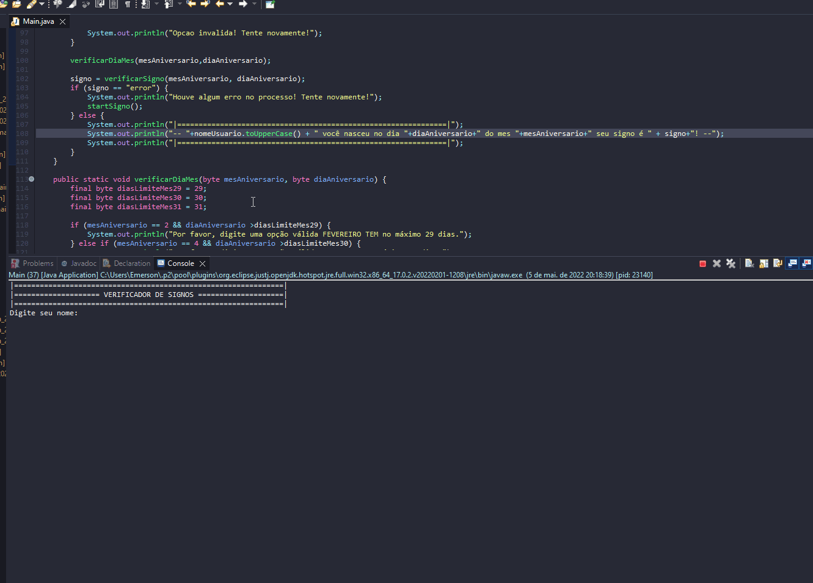

# Java Test - Whats Zodiac Signs

- Create a program that informs the sign of the user.
````
1 - Capture name, day and month of birthday.
2 - Create a constant for the limit number of the day of the month, in this case 31.
3 - IF
    3.1 - The day is greater than the threshold.
        * Inform the limit value for one day of the month.
4 - ELSE
    4.1 - Choose the corresponding month to carry out specific validations.
        * Does this day exist in this month?
        * Based on the day of the month what is the zodiac sign.
        * Invalid month.
````
---

## Application in use.

#



