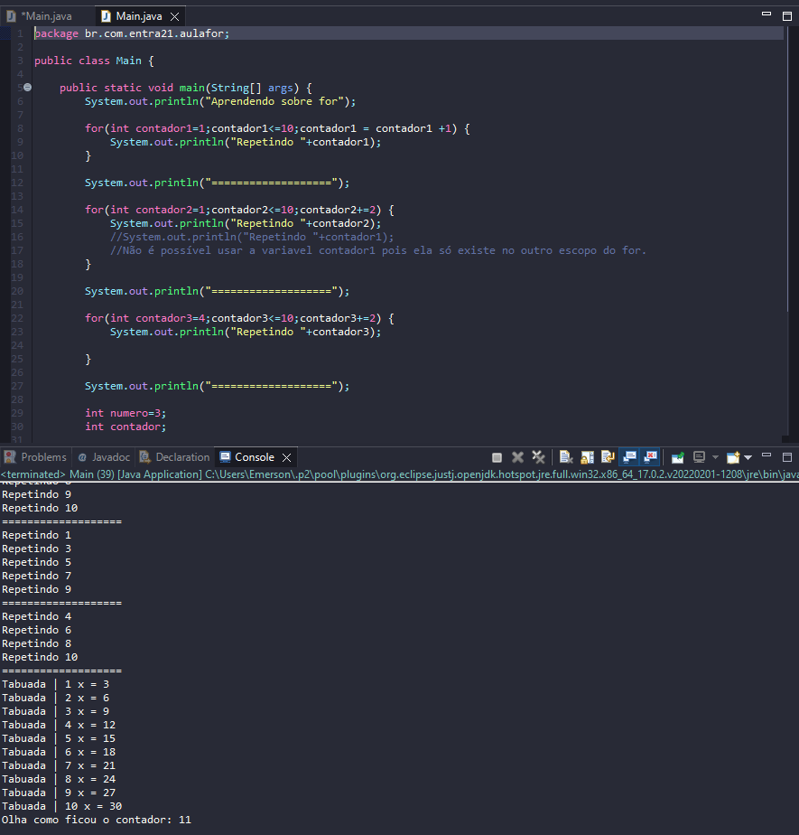

# Aprendendo sobre uso do For

- Ideal para repetições com base na quatidade.
- Variável com ponto de ínicio.
- Condição de permanencia.
- Incremento ou decremento , pensando na condição de permanência.

## Exemplos 

