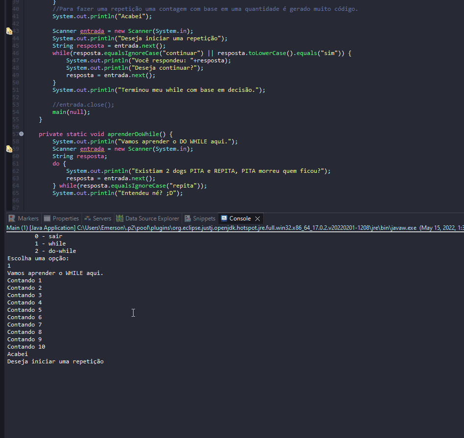

# Learning about using While and Do-While

- They are two decision-based repetition structures where the amount of repetitions is potentially infinite.
- As in every loop of repetition, it is important to pay attention to the criterion of permanence so that at some point it is possible to get out of it.

## Examples 

