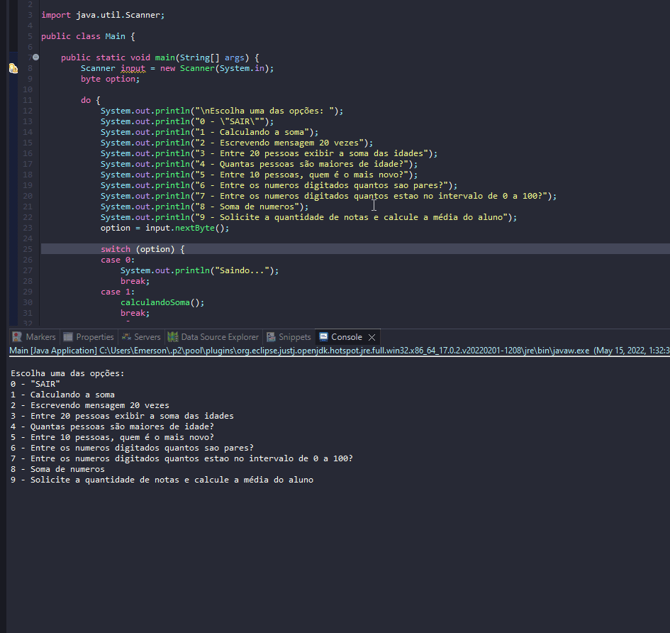

# Practice on While and Do-While

1. Write an algorithm that calculates the sum of the numbers from 1 to 15 and breaks the line every 5 repetitions.
2. Write an algorithm that displays the message “I like to study Algorithms” 20 times.
3. Read the age of 20 people and display the sum of their ages.
4. Read the age of 20 people and display how many people are of legal age.
5. Read the name and age of 10 people and display the name of the youngest person.
6. Write an algorithm that reads 20 numbers from the user and displays how many numbers are even.
7. Make an algorithm that reads 20 numbers and, at the end, writes how many are between 0 and 100.
8. Write an algorithm that reads a sequence of numbers from the user and performs the sum of those numbers. Terminate execution when a negative number is entered.
9. Write an algorithm that asks for the number of grades and calculates the student's average.

## Examples 

