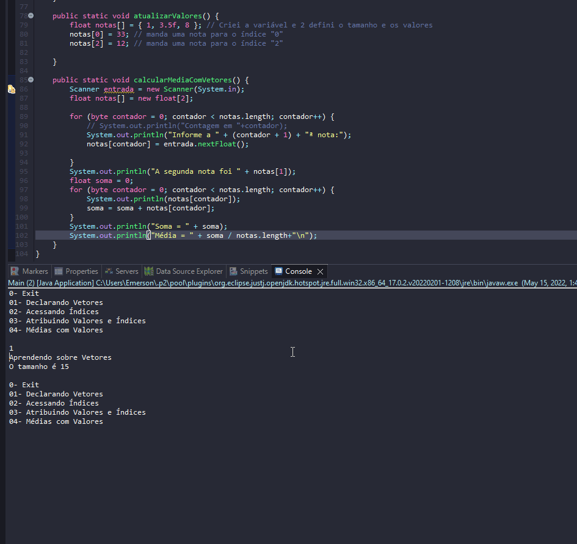

# Learning about Vectors

- Vectors are a very convenient way to organize information.
- Using vectors and matrices in Java involves three steps:
    1. Declare the vector or matrix. To do this, just add a pair of square brackets before or after the variable name. For example:
        - byte[] idades; 
        - float notas[];
    2. Reserve memory space and set the size. It is necessary to define the size of the vector, that is, the total amount of elements that will have to be stored. Then it is necessary to reserve memory space to store the elements. This is done simply by the new operator:
        - idades= new byte[10];
        - notas= new float[3];
    3. Store elements in vector or matrix. To store information in one of the elements of a vector or matrix, it is necessary to provide an index that indicates the position of that element. For example, to store a value in the fourth position of the ages vector, we do the following:
        - idades[3] = 18;
- Advantage:
    - The number of variables is reduced and the performance in writing algorithms is also reduced.
- Disadvantage:
    - The vector has a limited size and it is not possible to change it after it is created.
    - The count starts at position 0 "zero" which is initially counterintuitive.
    - When accessing positions that do not exist, they generate exceptions that, when not handled, terminate the application. This incorrect access in repeat loops is very common.
    - Based on these disadvantages, another disadvantage ends up occurring, which is creating more space than necessary and thus more memory is allocated, consuming the machine's resources and harming execution performance.

## Examples 

