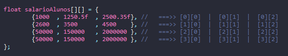

# Learning about Matrices

- Matrices are vectors that store vectors.
- Example:
    - I want to store 3 grades for each of my 5 students.
    - float gradesStudents[][]= new float\[5\]\[3\];
        - [0] ==> { 0f , 0f ,0f} 
        - [1] ==> { 0f , 0f ,0f} 
        - [2] ==> { 0f , 0f ,0f} 
        - [3] ==> { 0f , 0f ,0f} 
        - [4] ==> { 0f , 0f ,0f}  

## Examples 
Initialize an array with values.

```java
 float salaryStudents[][]= {
                {1000  , 1250.50f , 2500.35f}, 
				{2600  , 3500     , 4500    }, 
				{50000 , 150000   , 2000000 }, 
				{50000 , 150000   , 2000000 }, 
 		};
```

