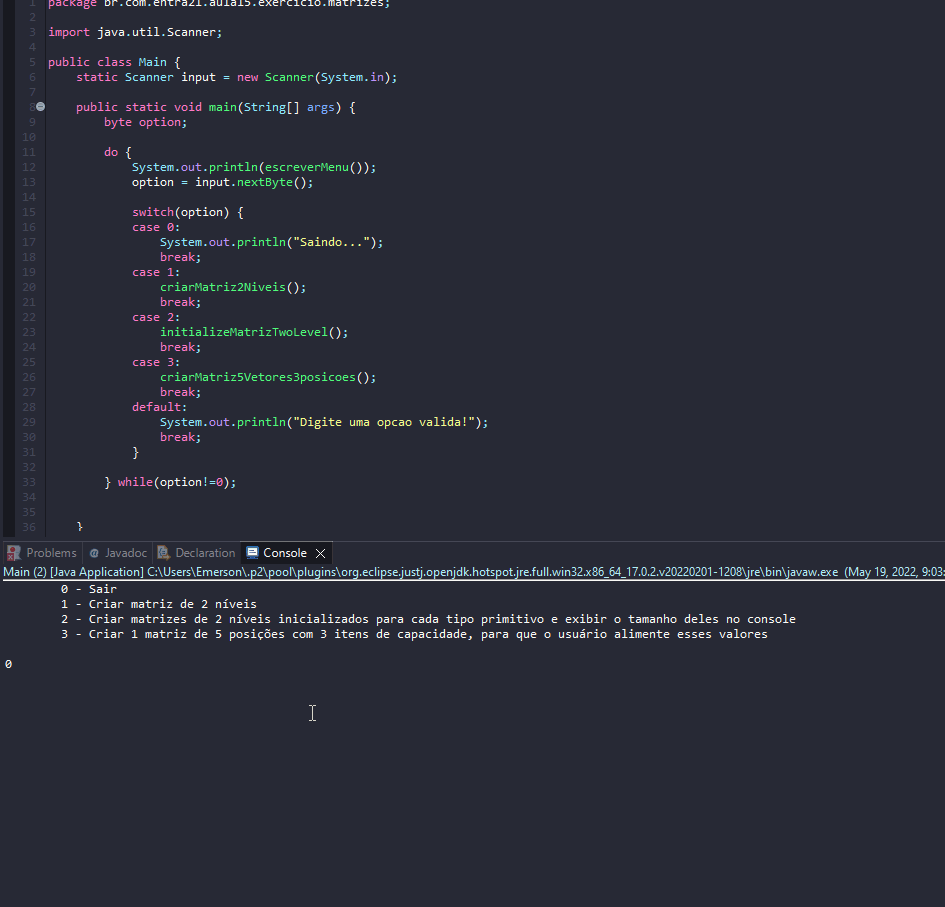

# Practice Repeat Loops on Matrices

- Create a java project where main should serve as a menu for each execution of the exercises
    - The program only closes when choosing the EXIT or 0 option
    - Before ending the execution, thank the user for using the program
    - Switch cases should not be complex, should call specific methods
    - Options in the menu
        1. Create 2-level arrays for each primitive type and display their size in console
            - Check the details in the DEBUG perspective
        2. Create initialized 2-level arrays for each primitive type and display their size in console
            - Check the details in the DEBUG perspective
        3. Create 1 array of 5 positions with 3 capacity items, for the user to feed these values
            - Check the details in the DEBUG perspective
        4. Create an array with the size and capacity entered by the user and then ask the user to enter the respective values
            - Check the details in the DEBUG perspective
        5. Create an initialized integer array, to loop through
            - from start to finish
            - from end to beginning
            - To display the values
        6. Create an uninitialized integer array
            - Repeat indefinitely until the user answers no to the question
                - Would you like to initialize the value of one of the positions between 1 and SIZE?
            - If you answer yes
                - Capture all values ​​for that index
                    - Retry capture to end of index capacity
            - If you answer no
                - Exit repeat launches
                - Display all array values

## Examples 

