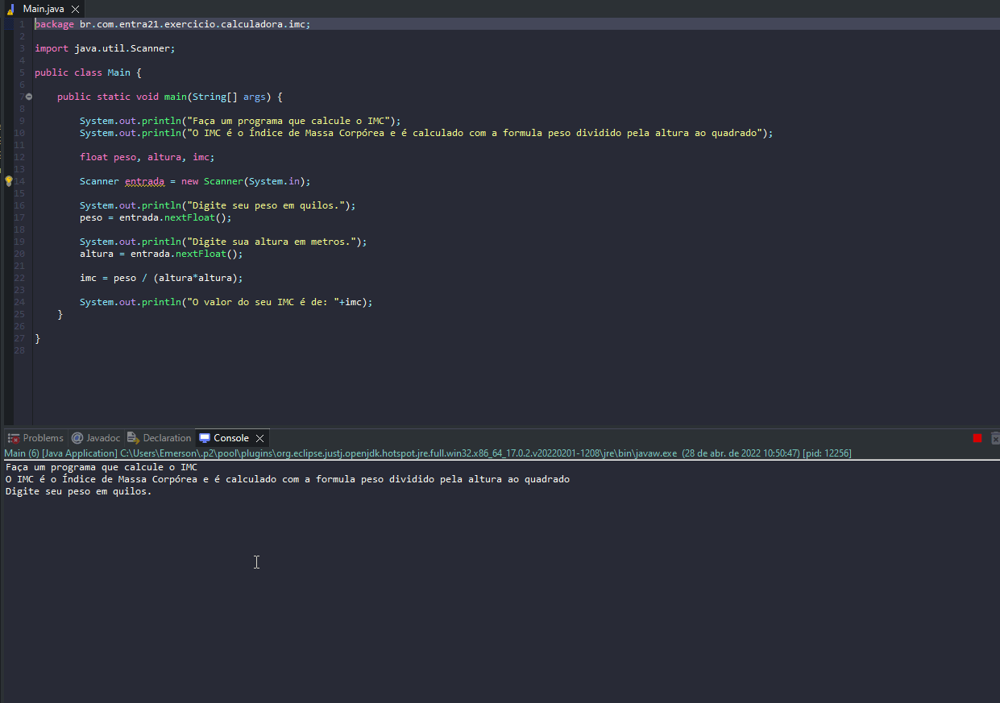

# Exercicio - Área e Perímetro

- Faça um programa que calcule o IMC.
- O IMC é o Índice de Massa Corpórea e é calculado com a formula peso dividido pela altura ao quadrado.
- IMC = PESO / (ALTURA^2)

## Aplicação em uso.

