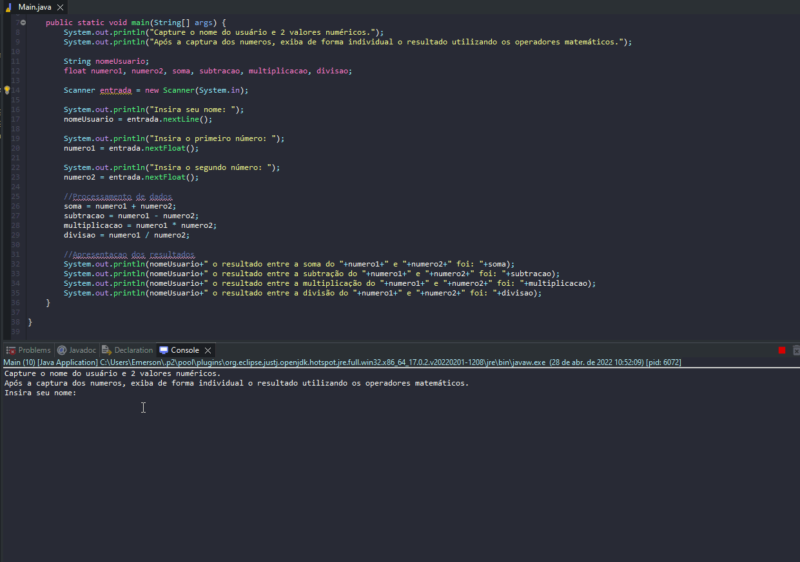

# Exercicio - Calculadora 4 Operações

- Faça um programa de calculadora.
- Capture o nome do usuário e 2 valores numéricos.
- Após a captura dos numeros, exiba de forma individual o resultado utilizando os operadores soma(+), subtração(-), divisão(/) e multiplicação(*).

## Aplicação em uso.

