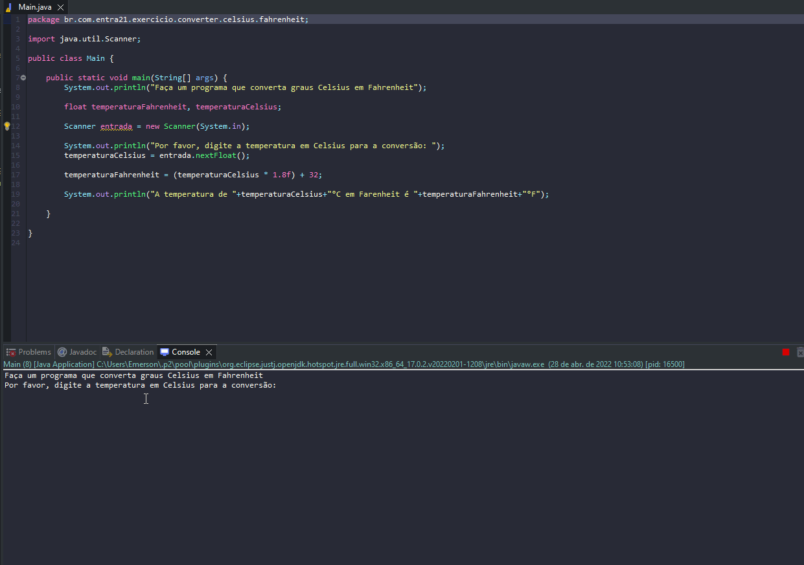

# Exercicio - Converter Celsius para Fahrenheit

- Faça um programa que converta graus Celsius em Fahrenheit.
- A formula para converter é multiplicar a temperatura celsius por 1.8 e somar 32 ao resultado.

## Aplicação em uso.

