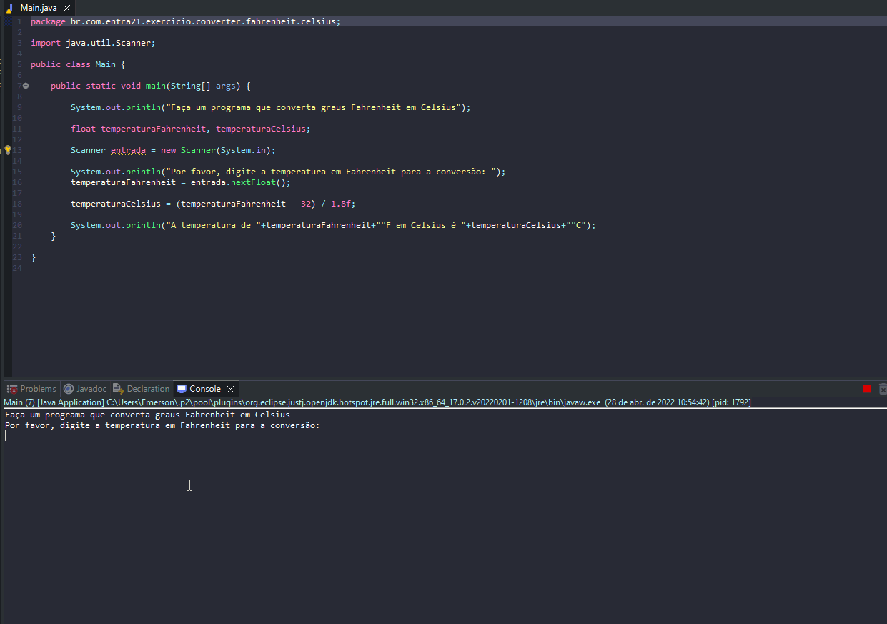

# Exercicio - Converter Fahrenheit para Celsius

- Faça um programa que converta graus Fahrenheit em Celsius.
- A formula para converter é subtrair a temperatura em 32 e dividir por 1.8.

## Aplicação em uso.

