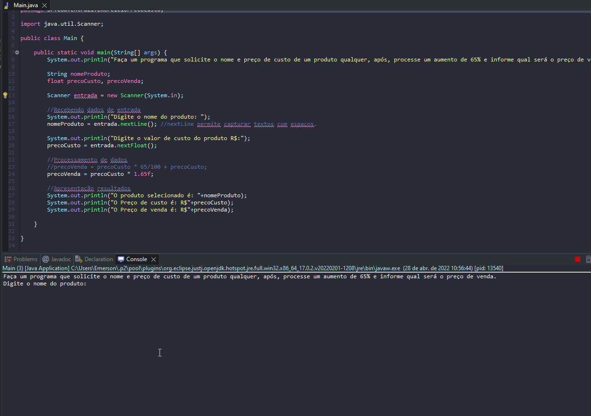

# Exercicio - Calcular Preço Venda

- Faça um programa que solicite o nome e preço de custo de um produto qualquer, após, processe um aumento de 65% e informe qual será o preço de venda..
- Aumentar um valor percentual é obtido matematicamente ao somar no valor do produto  com o resultado do calculo produto X (65 /100).
- Ou seja aumento=produto+ produto X (60/100).

## Aplicação em uso.

